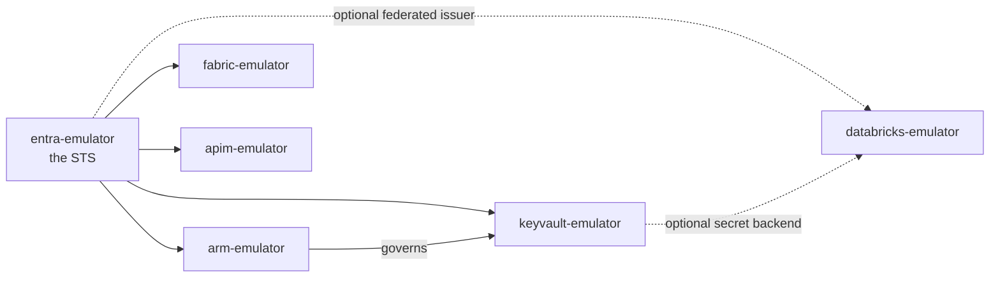

# 02 — The family

Six emulators, each its own repo, its own release cadence, its own GHCR
image. This repo composes them and proves they still trust each other.

| Emulator | Port | Role |
|---|---|---|
| [entra-emulator](https://github.com/calvinchengx/entra-emulator) | 8443 | **The STS.** Issues every token; publishes the JWKS the others validate against |
| [arm-emulator](https://github.com/calvinchengx/arm-emulator) | 8445 | ARM control plane + `Microsoft.Authorization` RBAC |
| [azure-keyvault-emulator](https://github.com/calvinchengx/azure-keyvault-emulator) | 8444 | Key Vault data plane — secrets, keys, certificates |
| [fabric-emulator](https://github.com/calvinchengx/fabric-emulator) | 9443 | Fabric control plane + OneLake. A consumer — `fabric` profile |
| [azure-apim-emulator](https://github.com/calvinchengx/azure-apim-emulator) | 8446 | API Management — management plane, gateway, policies. A consumer — `apim` profile |
| [databricks-emulator](https://github.com/calvinchengx/databricks-emulator) | 8447 | Databricks workspace REST. PAT + its own OIDC; entra optional — `databricks` profile |

## Dependency order

**entra is upstream of everything** — it is the only hard dependency in the
family, because a data plane with no STS cannot exercise the challenge flow
every Microsoft SDK performs. arm is upstream of keyvault by default: role
assignments and the vault resource's own configuration decide what the data
plane permits.

apim is a consumer of entra *alone*. It serves its own
`Microsoft.ApiManagement` ARM surface rather than calling arm — the same way
Azure's resource providers each own their surface behind one front door.

## Why the boundary is real

Each emulator is a static Go binary on distroless, so all six share one base
layer and cost a few tens of MB of RSS. Bundling them into one process would
save essentially nothing — and would cost the thing that makes this family
worth having: **keyvault and arm validating entra's tokens over HTTP against a
separate origin *is* the production trust relationship.**

Keep the boundary; compose across it.

## Issuer alignment is the one thing that must match

Tokens carry `iss = <entra origin>/<tenant>/v2.0`, so entra must **advertise**
the origin its peers validate against. On the compose network that origin is
`https://entra-emulator:8443` — hence `PUBLIC_ORIGIN`, and why every
`*_ENTRA_ISSUER` repeats it verbatim.

Get it wrong and every cross-service call fails `401` while each emulator's own
test suite stays green. That is precisely the failure
[the chain test](04-chain-test.md) exists to catch.

Point the `*_ENTRA_ISSUER` variables at a real tenant instead and nothing else
changes.

## Seeded identities

Shared across the family, and public knowledge by design:

| | |
|---|---|
| Tenant | `6f89cf12-978b-4d23-ac18-9ef0c127cf87` |
| Subscription | `6082bfda-63d0-46f4-8272-ae9195139feb` |
| Daemon app (confidential) | `00d88624-f0d7-46f6-a641-6232c2608928` / `daemon-app-secret` |

These are fixed random v4 GUIDs, not patterned placeholders. Real Entra never
issues GUIDs with repeating nibbles, and a uniform GUID is a weak test oracle:
it survives segment transposition and most mis-slicing, so a parsing bug can
pass unnoticed.
